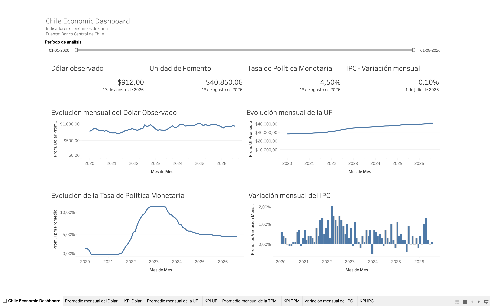

# Chile Economic Data Pipeline

Pipeline ETL desarrollado en Python para extraer, transformar, validar y almacenar indicadores económicos oficiales de Chile.

El proyecto obtiene información desde la API del Banco Central de Chile, aplica procesos de limpieza y control de calidad, almacena los resultados en PostgreSQL y disponibiliza los datos mediante consultas SQL, vistas analíticas y un dashboard desarrollado en Tableau.

## Dashboard



El dashboard permite analizar la evolución histórica de cuatro indicadores económicos:

- Dólar observado
- Unidad de Fomento (UF)
- Tasa de Política Monetaria (TPM)
- IPC - Variación mensual

Incluye valores actuales, evolución mensual y un filtro interactivo de período.

---

## Arquitectura

```text
                    Banco Central de Chile
                             API
                              │
                              ▼
                     ┌─────────────────┐
                     │   Python ETL    │
                     │   pipeline.py   │
                     └────────┬────────┘
                              │
             ┌────────────────┼────────────────┐
             ▼                ▼                ▼
          Extract          Transform        Validate
             │                │                │
             ▼                ▼                ▼
         RAW Data      Processed Data    Data Quality
                              │
                              ▼
                            Load
                              │
                              ▼
                    ┌─────────────────┐
                    │   PostgreSQL    │
                    │     Docker      │
                    └────────┬────────┘
                             │
               ┌─────────────┼─────────────┐
               ▼             ▼             ▼
          SQL Analytics     DBeaver      Tableau
               │
               ▼
             Views
```

---

## Indicadores

| Indicador | Serie Banco Central | Frecuencia |
|---|---|---|
| Dólar observado | `F073.TCO.PRE.Z.D` | Diaria |
| Unidad de Fomento | `F073.UFF.PRE.Z.D` | Diaria |
| Tasa de Política Monetaria | `F022.TPM.TIN.D001.NO.Z.D` | Diaria |
| IPC - Variación mensual | `F074.IPC.VAR.Z.Z.C.M` | Mensual |

Los datos son procesados desde enero de 2020.

---

## Tecnologías

### Data Engineering

- Python
- Pandas
- bcchapi
- python-dotenv
- psycopg
- PostgreSQL

### Calidad y testing

- Pytest
- Validaciones automatizadas
- Logging
- Auditoría de ejecuciones ETL

### Infraestructura

- Docker
- Docker Compose

### SQL

- PostgreSQL
- CTEs
- Window Functions
- `LAG()`
- `FILTER`
- Views
- UPSERT mediante `ON CONFLICT`

### Visualización y análisis

- Tableau
- DBeaver

### Control de versiones

- Git
- GitHub

---

## Pipeline ETL

El proceso completo se encuentra centralizado en:

```text
src/pipeline.py
```

La ejecución sigue cuatro etapas:

```text
EXTRACT
   ↓
TRANSFORM
   ↓
VALIDATE
   ↓
LOAD
```

### Extract

Obtiene los indicadores económicos desde la API del Banco Central de Chile y almacena los datos originales en:

```text
data/raw/
```

Los datos RAW se conservan sin modificaciones para mantener una copia de la información entregada por la fuente.

### Transform

Realiza procesos como:

- Conversión de tipos.
- Normalización de columnas.
- Eliminación de valores nulos.
- Eliminación de fechas duplicadas.
- Exclusión de observaciones futuras del dataset analítico.
- Generación de variables temporales:
  - Año
  - Mes
  - Día
  - Trimestre
- Normalización de los cuatro indicadores bajo una estructura común.

Los resultados son almacenados en:

```text
data/processed/
```

### Validate

Antes de cargar los datos en PostgreSQL se ejecutan controles automáticos de calidad.

Entre las validaciones se encuentran:

- Dataset no vacío.
- Columnas requeridas.
- Fechas válidas.
- Valores numéricos válidos.
- Ausencia de duplicados.
- Ausencia de fechas futuras.
- Validación de `series_id`.
- Validación de frecuencia.
- Validación de valores mínimos según el indicador.

Si alguna validación crítica falla, el proceso se detiene antes de realizar la carga.

### Load

Los datos procesados son cargados a PostgreSQL mediante `psycopg`.

La tabla principal es:

```text
economic_indicators
```

La clave primaria está compuesta por:

```text
series_id + observation_date
```

La carga utiliza:

```sql
ON CONFLICT (series_id, observation_date)
DO UPDATE
```

Esto permite ejecutar el pipeline varias veces sin generar registros duplicados.

---

## PostgreSQL

El proyecto utiliza PostgreSQL como base de datos analítica.

La tabla principal contiene:

```text
series_id
indicator_name
frequency
observation_date
value
year
month
day
quarter
loaded_at
```

El esquema se encuentra en:

```text
sql/schema.sql
```

---

## SQL Analytics

El archivo:

```text
sql/analytics.sql
```

incluye consultas para:

- Resumen general de indicadores.
- Promedios anuales.
- Promedios mensuales.
- Máximos y mínimos.
- Variaciones diarias del dólar.
- Mayores alzas y caídas.
- Cambios históricos de la TPM.
- Evolución de la UF.
- Análisis mensual del IPC.
- Comparación de indicadores.
- Controles de duplicados.
- Controles de valores nulos.

Se utilizan conceptos como:

```sql
LAG()
```

```sql
WITH ... AS
```

```sql
FILTER (WHERE ...)
```

y funciones de agregación.

---

## Views

El archivo:

```text
sql/views.sql
```

crea vistas analíticas para simplificar el consumo de información.

### `vw_latest_indicators`

Entrega la última observación disponible de cada indicador.

Es utilizada para los KPI del dashboard.

### `vw_monthly_economic_summary`

Consolida los indicadores a frecuencia mensual:

```text
mes
dolar_promedio
uf_promedio
tpm_promedio
ipc_variacion_mensual
```

Esta vista es utilizada por Tableau para construir los gráficos históricos.

---

## Auditoría ETL

Cada ejecución del pipeline queda registrada en PostgreSQL mediante la tabla:

```text
etl_runs
```

Se almacenan datos como:

```text
run_id
started_at
finished_at
status
records_extracted
records_transformed
records_loaded
duration_seconds
error_message
```

Los estados posibles incluyen:

```text
RUNNING
SUCCESS
FAILED
```

Esto permite mantener trazabilidad de las ejecuciones del pipeline.

---

## Logging

El pipeline también genera logs técnicos en:

```text
logs/pipeline.log
```

Ejemplo:

```text
INFO | Iniciando EXTRACT
INFO | EXTRACT completado
INFO | Iniciando TRANSFORM
INFO | Iniciando VALIDATE
INFO | Iniciando LOAD
INFO | PIPELINE COMPLETADO CORRECTAMENTE
```

Los archivos `.log` no son versionados en GitHub.

---

## Tests

El proyecto incluye pruebas automatizadas mediante `pytest`.

Actualmente se validan casos como:

- Dataset válido.
- Fechas duplicadas.
- Valores nulos.
- `series_id` incorrecto.
- Valores negativos no permitidos.

Para ejecutar los tests:

```bash
pytest -v
```

Resultado esperado:

```text
5 passed
```

---

## Docker

PostgreSQL y el pipeline ETL pueden ejecutarse mediante Docker Compose.

La arquitectura Docker contiene:

```text
docker compose
│
├── postgres
│   └── PostgreSQL 17
│
└── etl
    └── Python ETL
```

PostgreSQL utiliza un volumen persistente:

```text
postgres_data
```

El ETL se comunica internamente con PostgreSQL mediante:

```text
postgres:5432
```

Mientras que desde el sistema anfitrión la base está disponible en:

```text
localhost:5433
```

---

## Instalación

### 1. Clonar el repositorio

```bash
git clone https://github.com/josbello/chile-economic-data-pipeline.git
cd chile-economic-data-pipeline
```

### 2. Crear archivo de variables de entorno

Copiar:

```bash
cp .env.example .env
```

Luego completar las credenciales correspondientes.

Ejemplo:

```env
BCCH_USER=your_bcch_user
BCCH_PASSWORD=your_bcch_password

DB_HOST=localhost
DB_PORT=5433
DB_NAME=chile_economic_data
DB_USER=chile_etl_user
DB_PASSWORD=your_database_password

DOCKER_DB_PORT=5433
```

El archivo `.env` está excluido del repositorio mediante `.gitignore`.

---

## Ejecución con Docker

### Levantar PostgreSQL

```bash
docker compose up -d postgres
```

Comprobar estado:

```bash
docker compose ps
```

### Construir el ETL

```bash
docker compose build etl
```

### Ejecutar el pipeline

```bash
docker compose run --rm etl
```

El contenedor ejecutará automáticamente:

```text
Extract
→ Transform
→ Validate
→ Load
```

---

## Ejecutar localmente

Crear entorno virtual:

```bash
python -m venv .venv
```

Activarlo en macOS/Linux:

```bash
source .venv/bin/activate
```

Instalar dependencias:

```bash
pip install -r requirements.txt
```

Ejecutar:

```bash
python src/pipeline.py
```

Para desarrollo y tests:

```bash
pip install -r requirements-dev.txt
```

---

## DBeaver

PostgreSQL puede ser inspeccionado mediante DBeaver utilizando:

```text
Host: localhost
Port: 5433
Database: chile_economic_data
User: chile_etl_user
```

Esto permite consultar:

```text
economic_indicators
etl_runs
vw_latest_indicators
vw_monthly_economic_summary
```

---

## Tableau

Tableau se conecta directamente a PostgreSQL.

El dashboard utiliza:

```text
vw_latest_indicators
```

para los KPI y:

```text
vw_monthly_economic_summary
```

para los gráficos históricos.

Incluye:

- Último valor del Dólar.
- Último valor de la UF.
- Última TPM.
- Última variación mensual del IPC.
- Evolución mensual del Dólar.
- Evolución mensual de la UF.
- Evolución de la TPM.
- Variación mensual del IPC.
- Filtro interactivo por período.

---

## Estructura del proyecto

```text
chile-economic-data-pipeline/
│
├── data/
│   ├── raw/
│   └── processed/
│
├── docs/
│   └── images/
│       └── tableau-dashboard.png
│
├── logs/
│   └── .gitkeep
│
├── sql/
│   ├── analytics.sql
│   ├── schema.sql
│   └── views.sql
│
├── src/
│   ├── audit.py
│   ├── config.py
│   ├── discover_series.py
│   ├── extract.py
│   ├── load.py
│   ├── logger.py
│   ├── pipeline.py
│   ├── transform.py
│   └── validate.py
│
├── tests/
│   └── test_validate.py
│
├── .dockerignore
├── .env.example
├── .gitignore
├── Dockerfile
├── docker-compose.yml
├── pytest.ini
├── requirements.txt
├── requirements-dev.txt
└── README.md
```

---

## Seguridad

Las credenciales y configuraciones sensibles se almacenan mediante variables de entorno.

El repositorio no incluye:

```text
.env
contraseñas
credenciales de API
logs
entornos virtuales
datasets generados
```

Se proporciona únicamente:

```text
.env.example
```

como referencia para la configuración local.

---

## Posibles mejoras futuras

- Automatización mediante GitHub Actions.
- Scheduling periódico del ETL.
- Incorporación de nuevos indicadores económicos.
- Alertas ante fallos del pipeline.
- Mayor cobertura de tests.
- Despliegue de PostgreSQL en infraestructura cloud.
- Publicación web del dashboard.

---

## Autor

**José Bello Riquelme**

Ingeniero en Informática orientado al área de datos, automatización y desarrollo de soluciones tecnológicas.